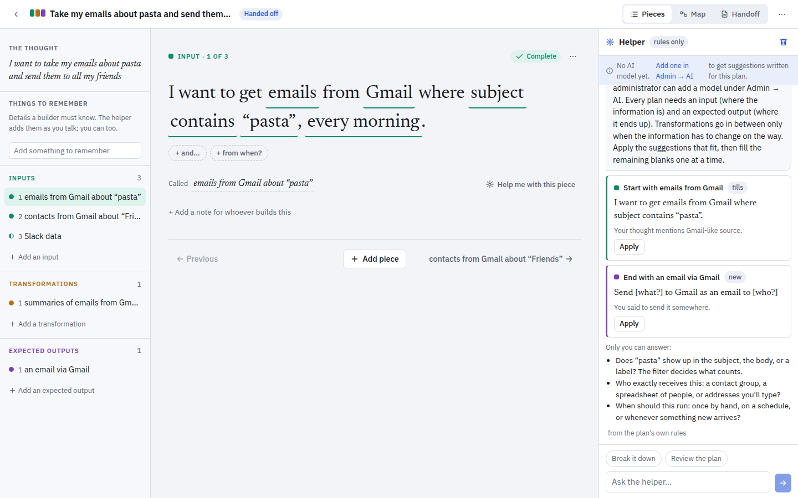
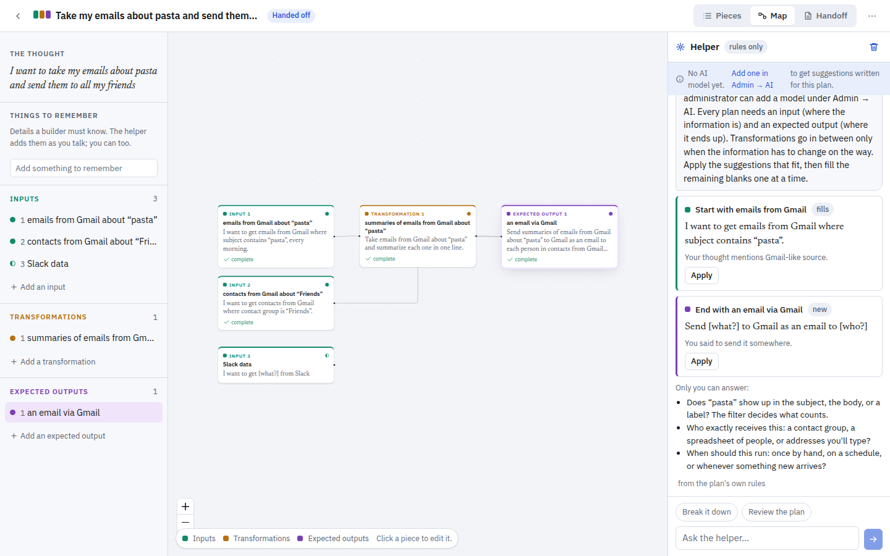
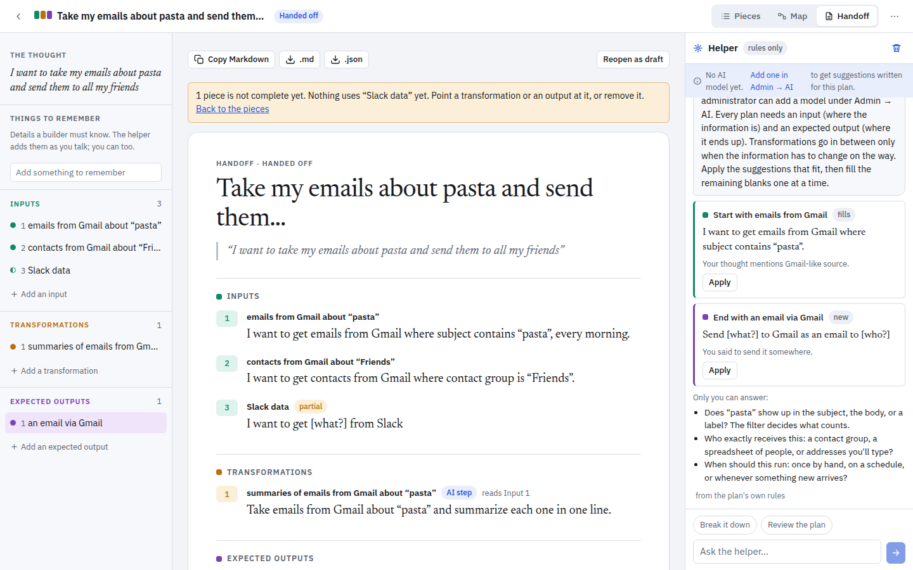
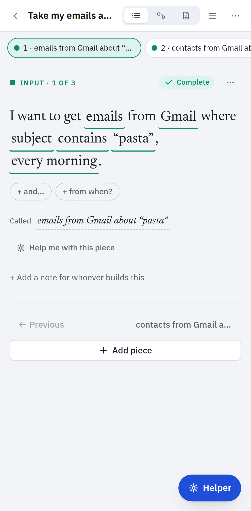

# Piecewise

Turn a big thought into pieces an AI can build.

Piecewise is a planning tool for AI workflows. A person writes down what they want ("I want to take my emails about pasta and send them to all my friends"), then breaks it into small pieces. Each piece is one sentence with blanks. The blanks come from plugin manifests, so a finished sentence names a real system, a real object, a real field. An always-on helper proposes fills; the person applies them with one click. The finished plan renders as a document an engineer or an AI agent can build from. It runs as one Node process with one SQLite file, so it fits inside a corporate network without external services.

Piecewise does not run automations. It produces the plan; something else builds and runs it.

## How it works

Every piece is exactly one of three kinds:

| Kind | Question it answers | Empty sentence |
|---|---|---|
| Input | Where does the information come from? | `From [somewhere]` |
| Transformation | What happens to it? | `Take [a piece] and [do what?]` |
| Expected output | Where does the result go? | `To [somewhere]` |

Filling a blank rewrites the sentence and opens the next blank, like a guided query builder:

```
From [somewhere]
I want to get [what?] from Gmail
I want to get emails from Gmail where [which ones?]
I want to get emails from Gmail where subject contains “pasta” from the last 30 days, every morning.
```

Each blank is a menu built from the plugin's manifest (objects, fields, operators, actions, parameters). Some blanks accept typed text. Optional blanks (time range, schedule, "how will I know it worked") appear only after the required ones are filled. A blank can be marked "I'm not sure yet"; it becomes a loose end that the plan tracks until someone settles it.

Pieces point at each other. A transformation's source is an input or another transformation; an output's source is either. The pasta plan from the end-to-end test, complete:

- Input: I want to get emails from Gmail where subject contains “pasta”, every morning.
- Input: I want to get contacts from Gmail where contact group is “Friends”.
- Transformation: Take emails from Gmail about “pasta” and summarize each one in one line.
- Expected output: Send summaries of emails from Gmail about “pasta” to Gmail as an email to each person in contacts from Gmail about “Friends”, and I’ll know it worked when “every friend gets exactly one email”.

The grammar (`shared/src/grammar/`) is the same code on the server and in the browser. It reports what is missing, drops stale values when an earlier choice changes, flags pieces nothing reads from, and marks steps that will need a language model when built (`summarize`, `classify`, `ask AI to`). A plan is ready to hand off when it has at least one input and one output, every piece is complete, and there are no loose ends or warnings. The Map view draws the pieces and their references as a graph.

## Screenshots









## Quick start

All three routes end at the same place: open the app in a browser, and the first visit redirects to `/setup` to create the first app administrator.

### Container

```
openssl rand -base64 32   # keep this value; it is your APP_SECRET
podman run -d --name piecewise -p 3000:3000 \
  -v piecewise-data:/data \
  -e APP_SECRET=<the value above> \
  ghcr.io/christag/piecewise:latest
```

`docker run` takes the same arguments. The image is built for linux/amd64 and linux/arm64, runs as the unprivileged `node` user, keeps its data in `/data`, and loads extra plugins from `/plugins`. A Podman Quadlet unit is in `deploy/piecewise.container`.

### Compose

```
cp .env.example .env      # set APP_SECRET at least
podman compose up -d      # or: docker compose up -d
```

`compose.yaml` builds the image from this checkout, mounts a named volume at `/data`, and mounts `./plugins-extra` read-only at `/plugins`.

### From source

Needs Node 22 or newer.

```
npm ci
npm run build
npm start
```

Then open http://localhost:3000/setup. Without `APP_SECRET`, a secret is generated once and kept in `data/.app-secret`; the database lands in `data/piecewise.sqlite`.

## Configuration

Every setting is an environment variable with a working default. The full list, with reverse-proxy, single sign-on, and trusted-header examples, is in [docs/deploy.md](docs/deploy.md). The five that matter most:

| Variable | Default | What it does |
|---|---|---|
| `APP_SECRET` | generated into `DATA_DIR/.app-secret` | Key that encrypts AI provider API keys at rest. Set it explicitly in production so it can be backed up and rotated. |
| `BASE_URL` | unset | Public address, for example `https://piecewise.example.com`. Required for OIDC. When it starts with `https://`, session cookies are marked Secure. |
| `DATA_DIR` | `./data` (`/data` in the image) | Holds the SQLite database and the generated secret. Back it up by copying the directory. |
| `BOOTSTRAP_ADMIN_EMAIL`, `BOOTSTRAP_ADMIN_PASSWORD` | unset | Creates the first app administrator on start when the database is empty. Password at least 10 characters; it must be changed at first sign-in. Otherwise use `/setup`. |
| `OIDC_ISSUER` | unset | Turns on single sign-on. Needs `OIDC_CLIENT_ID` and `BASE_URL`; add `OIDC_CLIENT_SECRET` if the provider issues one. `OIDC_ADMIN_EMAILS` names who becomes an administrator on first sign-in. |

Other variables: `PORT`, `HOST`, `TRUST_PROXY`, `SECURE_COOKIES`, `SESSION_DAYS`, `AUTH_LOCAL`, `OIDC_SCOPES`, `OIDC_BUTTON_LABEL`, `OIDC_DEFAULT_ROLE`, `AUTH_TRUSTED_HEADER`, `AUTH_TRUSTED_NAME_HEADER`, `AUTH_TRUSTED_PROXY_TOKEN`, `AUTH_TRUSTED_DEFAULT_ROLE`, `PLUGINS_DIR`, `DB_PATH`, `LOG_LEVEL`. See `.env.example` and `server/src/config.ts`.

## Roles

| Role | Can |
|---|---|
| `user` | Create and edit their own plans, use the helper, export handoffs. Sees the catalog of enabled integrations. |
| `integration_admin` | Everything a user can, plus edit the integrations assigned to them: the helper guidance, the access notes, and hiding individual objects, actions, or operations. |
| `app_admin` | Everything, plus people and roles, AI providers and keys, enabling plugins and assigning their owners, organization guidance and the preferred builder, plugin reload, and the audit log. Can open any plan. |

Roles are ranked (`user` < `integration_admin` < `app_admin`). They are set in Admin → Users, or on first sign-in by `OIDC_ADMIN_EMAILS`, `OIDC_DEFAULT_ROLE`, and `AUTH_TRUSTED_DEFAULT_ROLE`.

## The helper

The helper is the panel next to the sentence. It answers in four modes: break the thought into pieces, help with the blank in front of you, review the plan before handoff, and plain chat. An app administrator adds a provider under Admin → AI; one provider is active at a time, and a Test button checks the connection.

| Kind | How it is called | Key |
|---|---|---|
| `anthropic` | Claude through the Anthropic SDK, with a structured output format | required |
| `openai` | The OpenAI Responses API | required |
| `openai_compatible` | Chat Completions with a JSON-schema response format, for gateways and self-hosted servers that speak the OpenAI wire format | optional |

API keys are sealed with AES-256-GCM under a key derived from `APP_SECRET` (scrypt) before they are stored. Only the last four characters are shown again. If `APP_SECRET` changes, stored keys become unreadable and must be re-entered.

The system prompt (`server/src/helper/prompt.ts`) carries the full catalog and the organization's guidance. Nothing is sent to any model until an administrator configures one.

With no provider, or when a call fails, a rule-based fallback answers instead (`server/src/helper/fallback.ts`). It matches words in the thought against integration names and aliases, guesses one transformation from a short list of verbs, and repeats what the grammar says is missing. It is limited: it cannot read intent beyond those keywords, and it says so in every reply.

Every suggestion, whether from a model or from the rules, is applied through the grammar before a person sees it (`server/src/helper/apply.ts`). Each slot value is matched against the options the grammar offers at that point; values that do not fit are dropped and listed as dropped. A suggestion that applies nothing is marked invalid. A made-up field or integration never reaches a plan. Facts the person states ("friends means my Friends contact group") are kept on the plan as things to remember and go into the handoff.

## Plugins

A plugin is a directory holding a `plugin.json` and, optionally, a `README.md`. No code. There are two kinds: `integration` plugins describe the objects you can read (inputs) and the actions you can take (outputs); `transforms` plugins describe operations. The schema is `shared/src/manifest.ts`, and a plugin's `id` must match its directory name. From `plugins/google-sheets/plugin.json`:

```json
{
  "id": "google-sheets",
  "kind": "integration",
  "roles": ["input", "output"],
  "objects": [
    {
      "id": "rows",
      "label": "rows",
      "singular": "row",
      "allowCustomFields": true,
      "qualifier": { "label": "in the spreadsheet", "placeholder": "which spreadsheet?" },
      "fields": []
    }
  ],
  "actions": [
    {
      "id": "append_rows",
      "label": "new rows",
      "verb": "Add",
      "params": [{ "id": "spreadsheet", "label": "in the spreadsheet", "type": "text", "placeholder": "which spreadsheet?" }]
    }
  ]
}
```

23 plugins ship built in: `bamboohr`, `confluence`, `core-transforms`, `file-share`, `gmail`, `google-calendar`, `google-drive`, `google-sheets`, `http-api`, `jira`, `microsoft-teams`, `monday`, `notion`, `outlook`, `report`, `salesforce`, `servicenow`, `sharepoint`, `slack`, `sql-database`, `web-rss`, `workday`, `zendesk`. Writing one is covered in [docs/plugins.md](docs/plugins.md).

To add your own, point `PLUGINS_DIR` at a directory with one subdirectory per plugin (the image uses `/plugins`; compose mounts `./plugins-extra` there). Plugins load at start and on Admin → Integrations → Reload. Check a directory before shipping it with `npm run validate-plugins`. Administrators can disable a plugin, hide its objects, actions, or operations, and replace its helper guidance and access notes; users only ever see the resulting catalog.

## Handoff

The Handoff tab renders the plan as a document: the thought, things to remember, every piece numbered within its kind (Input 1, Transformation 1, Expected output 1) with its sentence, what it reads from, notes, and loose ends. A "How this should be built" section carries the organization guidance, the preferred builder, and the guidance and access notes of each integration the plan touches. Copy it as Markdown, or download `.md` or `.json`; the JSON is the `HandoffDocument` shape in `shared/src/handoff.ts`, also served at `GET /api/plans/:id/handoff`.

"Write the brief" asks the active model for a build brief in fixed sections: summary, steps, data and access needed, open questions, suggested build approach. The prompt includes the organization guidance and the preferred builder (for example "Claude Routines for most tasks; n8n only for high-volume pipelines"), and tells the model to recommend it unless the plan cannot be built that way. Without a model, a template brief with the same sections is produced from the grammar. "Mark as handed off" records the status.

## Security

Details and the threat model are in [docs/security.md](docs/security.md). In short:

- Passwords are hashed with scrypt. Sessions are random tokens stored in SQLite, sent as an `HttpOnly`, `SameSite=Lax` cookie, `Secure` when `BASE_URL` is https.
- Single sign-on uses OpenID Connect authorization code with PKCE, `state`, and `nonce`, through `openid-client`. It is tested against a mock provider (`oauth2-mock-server`), not against a specific vendor.
- Trusted-header sign-in (for oauth2-proxy and similar) can require a shared secret in `X-Piecewise-Proxy-Token`, so the identity header cannot be spoofed from inside the network.
- State-changing API calls are rejected when the `Origin` header does not match the host or `BASE_URL`.
- AI provider keys are encrypted at rest (AES-256-GCM, key derived from `APP_SECRET`).
- Responses carry a Content Security Policy, `X-Frame-Options: DENY`, `X-Content-Type-Options: nosniff`, `Referrer-Policy: same-origin`, and a restrictive `Permissions-Policy`. API responses are `no-store`.
- Rate limits: 600 requests per minute per client, 10 per minute on sign-in, 5 on setup, 30 on helper calls.
- Administrative actions are written to an audit log readable in Admin → Audit.
- The container runs as a non-root user with a 1 MB request body limit.

Known limits: one process, one SQLite file. There is no clustering, external database, or horizontal scaling. Back up `DATA_DIR`.

## Project layout

```
shared/         Types, manifest schema, grammar, handoff rendering (used by server and web)
server/         Fastify API: auth, plans, helper, plugins, admin; SQLite via better-sqlite3
web/            React app (Vite); built output is served by the server
plugins/        The 23 built-in plugin manifests
plugins-extra/  Drop-in directory for your own plugins (mounted at /plugins by compose)
e2e/            Playwright tests: desktop and mobile
scripts/        validate-plugins
deploy/         Podman Quadlet unit and env example
docs/           deploy.md, plugins.md, security.md, images/
Containerfile   Single image, no external services (Dockerfile is a symlink)
compose.yaml    Compose file for podman compose or docker compose
.env.example    Every environment variable with a comment
```

## Development

```
npm ci
npm run dev              # server on :3000 with reload, web on :5173 proxying /api
npm run typecheck        # every workspace
npm test                 # vitest: shared (grammar) and server (auth, plans, helper, OIDC)
npm run validate-plugins # every plugins/<id>/plugin.json against the schema, plus a grammar smoke test
npm run build            # shared typecheck, web bundle, server bundle (esbuild -> server/dist/server.js)
npm run test:e2e         # Playwright against a running app at PW_BASE_URL (default http://localhost:3210)
```

The end-to-end tests need Chrome and a running instance; CI starts one with `NODE_ENV=production PORT=3210` before running them. The desktop project runs first and the mobile project (Pixel 7 emulation) reuses its account. CI (`.github/workflows/ci.yml`) runs typecheck, plugin validation, unit tests, build, and end-to-end on every push and pull request, and publishes the image to `ghcr.io` on pushes to `main` and version tags.

## License

Piecewise is copyright Chris Tagliaferro and is licensed to the public under the **GNU Affero General Public License v3.0 or later** (`LICENSE`). In plain terms:

- You may clone, run, modify, and redistribute it, including inside a company.
- Keep the copyright and license notices; the original attribution stays with the code.
- If you modify Piecewise and let people use it, including over a network, you must make the source of your modified version available to them under the same license. Hosting your fork in a public repository is the simplest way to comply.

**Morning Brew Inc.** holds a separate, exclusive, unconditional license to use and modify Piecewise as it pleases, without the conditions above. See `LICENSE-MORNING-BREW.md`.

Contributions are accepted under the terms in `CONTRIBUTING.md`, which allow the copyright holder to include them in both licenses.
